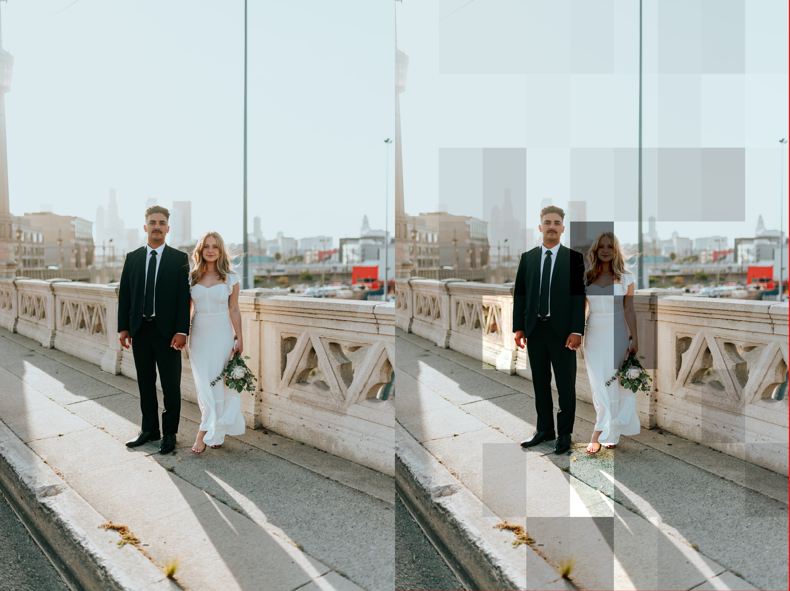

# dhash_collision
 This is a program designed to create dHash collisions given a target image or a target hash. You should read the blog post here: https://dev.to/living_syn/creating-image-hash-collisions-2g41.
 
 For instance given the two photos:


You can make the second image (`wedding.jpeg`) have the same dHash value as the first image (`city.jpeg`) The output would look like:



Where the left hand side is the original and the right hand side is an image made to have the same dHash value as `city.jpeg`

# Usage
```
dhash_collision.py [-h] [-s HASH_SIZE] [-c COLLISION_TARGET] [-t COLLISION_HASH] mod_image image_out
```

Example:

```
python3 dhash_collision.py -c ./light_photos/city.jpeg ./light_photos/wedding.jpeg collision.jpeg
```

# Known limitations
This will not work on very dark images at the moment because this tool relies on being able to brighten dark sectors of an image. If you brighten black you get....more black.